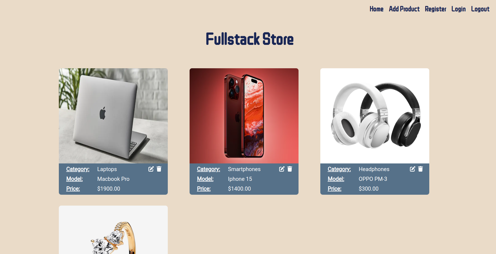

# Fake Shop Fullstack App

## Screenshots

## Project Overview

### Introduction
Welcome to Fake Shop, a full-stack web application built with React for the frontend, Node.js and Express for the backend, and MySQL as the database. Fake Shop allows users to register, login, view products, and perform CRUD operations on products. The application prioritizes user authentication and data validation to ensure a secure and seamless experience.

### Features

- **User Authentication:**
  - Users can register an account.
  - Users can log in and log out securely.
  - Authentication ensures that only registered users can perform certain actions.

- **Product Management:**
  - Users can view a list of products.
  - Registered users can add, edit, and delete products.

- **Password and Email Validation:**
  - Validation ensures that only valid email addresses and passwords are accepted during registration and login processes. Passwords are hashed before saving in the database.

### Technologies Used

The Fakeshop project is built using the following technologies:

- React (Vite)
- Node.js (Express)
- CSS
- HTML
- Mysql

## Getting Started

To get started with the Fakeshop project, follow these steps:

1. Clone the repository.

### Backend
2. Navigate to the folder `cd fake-shop`, `cd server`.
3. Install the necessary dependencies `npm i`.
4. Run the application `npm run dev`.

### Database
5. Open the file `queriesFakeShop.sql` and run the commands to create a database, users and products table and to fill them in.
6. At the users table there are two users; to log in you can use the following credentials:
- email: `test1@gmail.com` password: `Test1234!`
- email:`test2@gmail.com` password: `Test1234!`

### Frontend
7. Navigate to the folder `cd client`.
8. Install the necessary dependencies `npm i`.
9. Run the application `npm run dev`.
10. Go to `http://localhost:5173/`.

## Possible future improvements
- Typescript
- Improve login and authentification system
- Improve the logic of the app